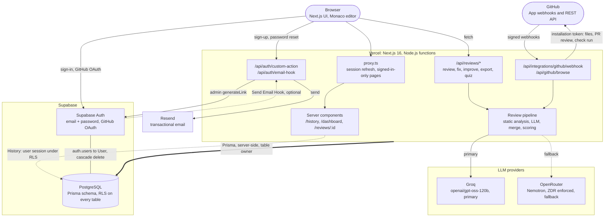
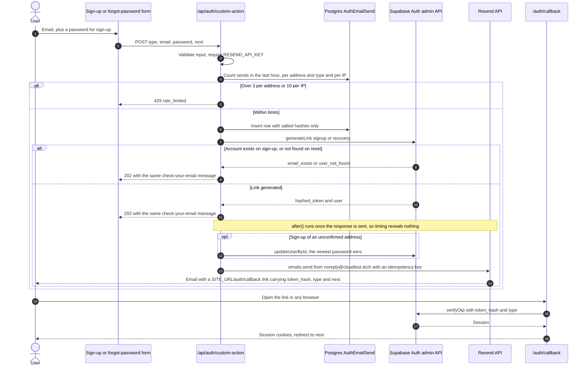
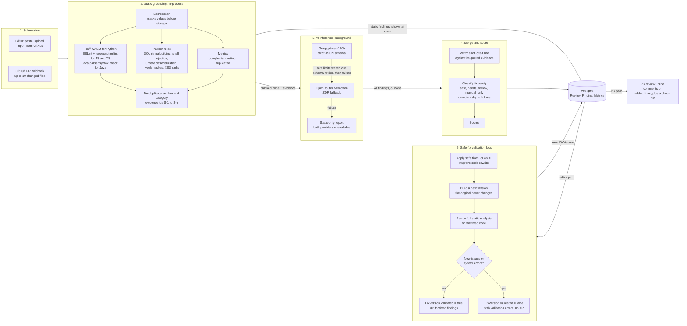
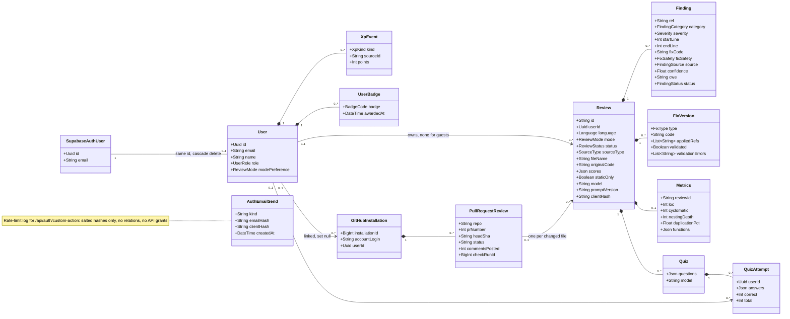

# CodeGuard AI

A code reviewer that explains itself. Paste or import a Python, JavaScript, TypeScript or Java file (or open a pull request on a repository with the CodeGuard GitHub App) and CodeGuard combines deterministic static analysis with an LLM to report bugs, security issues and slow spots, explain why they matter, and propose fixes that are re-validated before they count. Student Mode adds plain-language explanations, quizzes built from your own mistakes, and XP, levels and badges.

Live at [cloudtest.tech](https://cloudtest.tech). Next.js 16 (App Router) on Vercel, Supabase (Auth + Postgres via Prisma), Groq and OpenRouter for inference, Resend for email.

- [Architecture](#architecture)
- [Authentication & Email Routing](#authentication--email-routing)
- [Code Review Pipeline](#code-review-pipeline)
- [Data Model](#data-model)
- [Development](#development)

## Architecture

The browser talks to Next.js route handlers and server components on Vercel. Server code reaches Postgres through Prisma, as the table owner. Row-level security protects Supabase's auto-generated REST API: every table has RLS, signed-in users get read-only, owner-scoped policies, and the History page reads through the user's own Supabase session under those policies. Reviews call Groq first and fall back to OpenRouter (zero data retention enforced on every request); if both fail, the review degrades to static-analysis results. The GitHub App drives PR reviews through signed webhooks and also powers "Import from GitHub" in the editor.



## Authentication & Email Routing

Sign-in (password or GitHub OAuth) goes straight from the browser to Supabase Auth. Sign-up confirmations and password resets go through `/api/auth/custom-action` instead of Supabase's mailer: the admin API generates the one-time link without sending anything, and Resend delivers it. Because Supabase's email rate limits no longer apply, the endpoint enforces its own and answers the same way whether or not an account exists.



Notes:

- Links are always built on `SITE_URL` (default `https://cloudtest.tech`), never on the request's `Host` header, so a spoofed host can't redirect a valid token.
- The newest-password rule blocks account pre-hijacking: someone who registers your address first can't keep a password on it once you confirm.
- `/api/auth/email-hook` implements Supabase's Send Email Hook (Standard Webhooks signature check, then Resend). It only matters for emails Supabase itself initiates and is enabled in the Supabase dashboard, not in code.

## Code Review Pipeline

A review starts with deterministic static analysis, which answers within the request (`202`, findings shown immediately) and grounds the LLM: every analyzer finding is passed to the model as evidence it must address. The AI stage runs in the background. Its output is merged with the evidence, every cited line is checked against the source, and fix safety is re-classified before scoring. Fixes never modify the original code; each applied set becomes a new version that is re-analyzed, and only versions that introduce no new issues count as validated.



Notes:

- Validation re-runs the static analyzers on the fixed file and compares the findings with the original; no tests are executed. A version that fails is still saved, with its validation errors, so the user can inspect the diff, but it earns no XP.
- PR reviews run in developer mode, review each changed file in full, and comment only on findings on lines the PR added. The check run is `failure` for new critical or high findings, `neutral` for medium, otherwise `success` (or `neutral` if CodeGuard itself fails).
- The same LLM client also generates quizzes (`/api/reviews/:id/quiz`) and Improve Code rewrites.

## Data Model

Core tables from `prisma/schema.prisma`. `User.id` is the Supabase `auth.users` id; that foreign key (cascade delete) is added in `prisma/rls.sql`, so deleting an account removes all of its data. Guest reviews have no user. XP is an append-only ledger, idempotent on `(userId, kind, sourceId)`, from which levels, streaks and badges are derived.



Unique keys: `Finding (reviewId, ref)`, `XpEvent (userId, kind, sourceId)`, `UserBadge (userId, badge)`, `PullRequestReview (repo, prNumber, headSha)` (webhook redeliveries are no-ops), `GitHubInstallation.installationId`.

## Development

This is a [Next.js](https://nextjs.org) project bootstrapped with [`create-next-app`](https://nextjs.org/docs/app/api-reference/cli/create-next-app).

### Getting Started

First, run the development server:

```bash
npm run dev
# or
yarn dev
# or
pnpm dev
# or
bun dev
```

Open [http://localhost:3000](http://localhost:3000) with your browser to see the result.

You can start editing the page by modifying `app/page.tsx`. The page auto-updates as you edit the file.

This project uses [`next/font`](https://nextjs.org/docs/app/building-your-application/optimizing/fonts) to automatically optimize and load [Geist](https://vercel.com/font), a new font family for Vercel.

### Learn More

To learn more about Next.js, take a look at the following resources:

- [Next.js Documentation](https://nextjs.org/docs) - learn about Next.js features and API.
- [Learn Next.js](https://nextjs.org/learn) - an interactive Next.js tutorial.

You can check out [the Next.js GitHub repository](https://github.com/vercel/next.js) - your feedback and contributions are welcome!

### Deploy on Vercel

The easiest way to deploy your Next.js app is to use the [Vercel Platform](https://vercel.com/new?utm_medium=default-template&filter=next.js&utm_source=create-next-app&utm_campaign=create-next-app-readme) from the creators of Next.js.

Check out our [Next.js deployment documentation](https://nextjs.org/docs/app/building-your-application/deploying) for more details.
